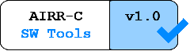

# Software Tools Compliance Badge

A compliance badge for your website. Please only use if your tool has been certified compliant against the appropriate version of the Software Tools Standard.

Simply place sw_tools_badge_v1.0.png in your directory and then use the following to include it in your projects:

```html
<a href="https://docs.airr-community.org/en/stable/swtools/overview.html">
    
</a>
```

<a href="https://docs.airr-community.org/en/stable/swtools/overview.html">
    
</a>
